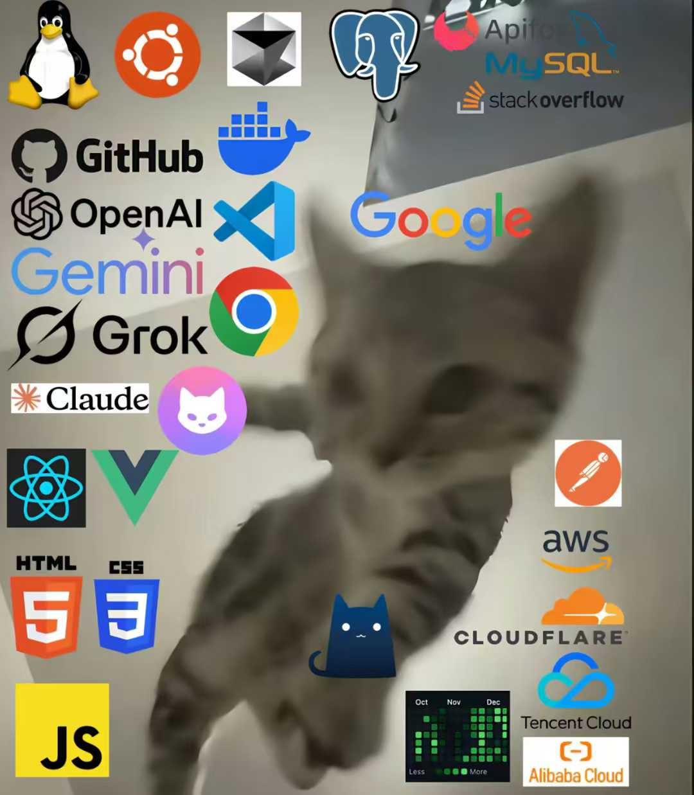

<div align="center">


[](https://git.io/typing-svg)

<a href="https://github.com/MoYiC6?tab=followers"></a>
<a href="https://github.com/MoYiC6?tab=repositories"></a>


</div>

## `$ whoami`

```yaml
name: 辰ing
location: Wuhan, China
focus: [AI Agents, Developer Tools, Agent Infrastructure]
currently_building: ViceMe
favorite_languages: [Go, TypeScript]
status: Shipping ideas into reality
```

我是一名专注于 **AI Agent 与开发者工具** 的构建者，喜欢把复杂的智能体能力变成可靠、可组合、真正能被使用的产品。

I build at the intersection of **AI agents, developer experience, and infrastructure** — with a focus on tools that do more than answer: they act, remember, and evolve.

- 🚀 正在参与构建 **[ViceMe](https://viceme.ai)**，探索下一代个人 AI Agent
- 🛠️ 主要使用 **Go** 与 **TypeScript** 构建 CLI、服务端系统和 Web 产品
- 🧠 关注 Agent Harness、Skills、Memory、Tool Use 与可观测性
- 🌱 持续参与开源，从真实问题出发提交代码

<div align="center">
  
  <br />
  <sub>My development environment, more or less.</sub>
</div>

## Selected Work

<table>
<tr>
<td width="50%" valign="top">

### [ViceMe CLI](https://github.com/ViceMe-AI/cli)

面向 Codex、Claude Code 等 AI Coding Tools 的官方 CLI 与 Agent Skill。提供确定性的认证、上传、发布和状态协议，让外部 Skill 成为稳定、可分享的 ViceMe Agent。

`Go` `Agent Skills` `CLI` `Developer Tools`

</td>
<td width="50%" valign="top">

### [ViceMe](https://viceme.ai)

个人 AI Agent 产品与基础设施集合，覆盖 Next.js、NestJS、Go、Temporal、gRPC、Langfuse 与完整可观测性体系。

`TypeScript` `Go` `Temporal` `AI Agents`

</td>
</tr>
<tr>
<td width="50%" valign="top">

### [Cgame](https://github.com/MoYiC6/Cgame)

使用 Go、Vue 与 TypeScript 构建的全栈项目，也是我持续投入最多的个人公开仓库之一。

`Go` `Vue` `TypeScript` `Full Stack`

</td>
<td width="50%" valign="top">

### Open Source Contributions

向 AI 模型目录、Coding Agent 工具链与 AI Gateway 等项目提交贡献，包括 models.dev、CLIProxyAPI、OpenClaw Control Center 等。

`Open Source` `AI Tooling` `Pull Requests`

</td>
</tr>
</table>

## Tools I Use

<div align="center">


</div>

## GitHub Activity

<div align="center">


</div>

## Let's Connect

<div align="center">

<a href="mailto:lubowitzvhdyx73@gmail.com"></a>
<a href="https://github.com/MoYiC6"></a>
<a href="https://github.com/ViceMe-AI"></a>

<br /><br />

<sub>Open to interesting ideas, meaningful collaboration, and building things that should exist.</sub>


</div>
